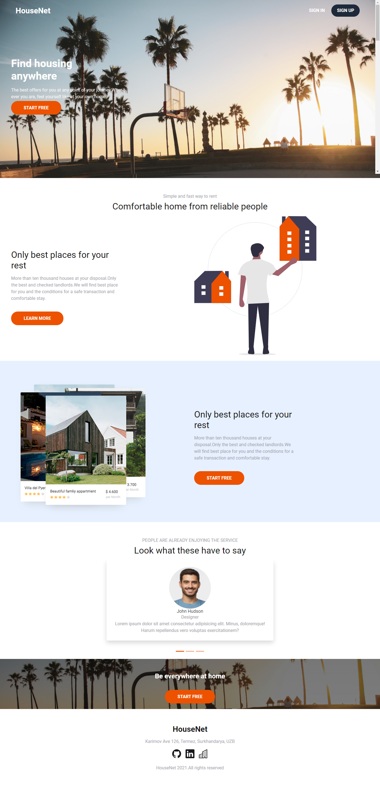
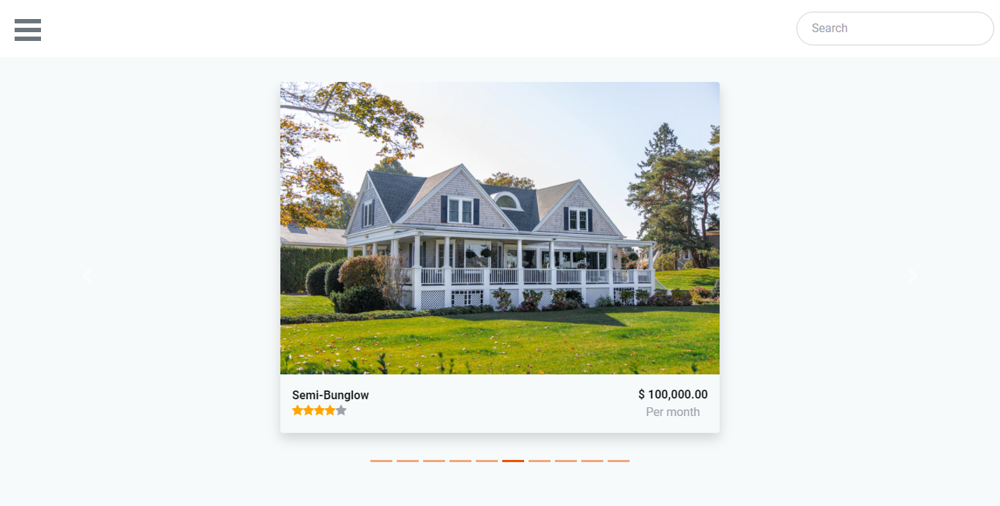
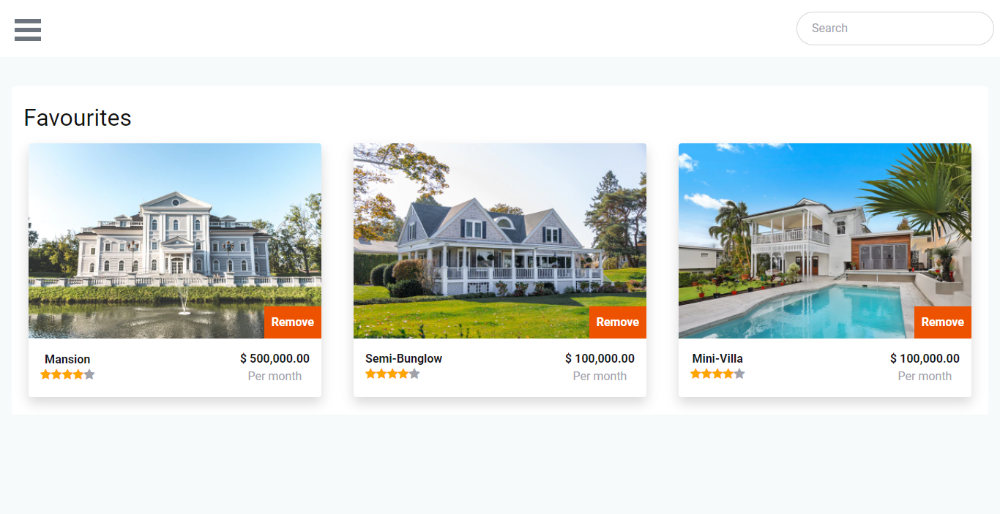

# Find your house

- This the the frontend part for the capstone project of Microverse main technical curriculum.
  This project is an house finding app where users are able to see a list of different types of houses and can add them to their favourites. Users can see the details of a particular house by clicking the houses.

### Main page

### Houses page

### Dashboard

## Live Demo

- [Live](https://pets-finder.netlify.app/)

## Main Features

- A proper authentication system has been implemented using JWT and Devise Warden.Users can sign up and login to the app.
- User can see list of houses.Houses displayed using Carousel.
- User can see details of houses and they can add them to his favourites.
- User can add and delete his favourites.
- User can see his favourites in his dashboard.

## API

- The backend API for this project created by me and can be found in [github](https://github.com/Murodjon000/Houses-api).

## Built with

- JavaScript
- React
- JSX
- SCSS
- Node
- Redux
- API

## Getting Started

- Clone the repo `git@github.com:Murodjon000/Pets.git`
- cd `into` the project
- Run `git pull origin app`
- Run `yarn install` or `npm install` to install dependencies
- On the terminal run `npm run start` open up the live server
- To run tests write `npm run test` on the terminal

## Author

👤 **Murodjon Tursunpulatov**

- Github: [@murodjon000](https://github.com/murodjon000)
- Twitter: [@MurodjonTursun5](https://twitter.com/MurodjonTursun5)
- Linkedin: [@Murodjon Tursunpulatov](https://www.linkedin.com/in/murodjon-tursunpulatov-5189481b3/)

## 🤝 Contributing

Contributions, issues and feature requests are welcome!

Feel free to check the [issues page](issues/).

## Show your support

Give a ⭐️ if you like this project!

## 👏 Acknowledgements

- [Microverse](issues/)
- All the images of houses used in this app are taken from [unsplash](https://unsplash.com/) and belong to the respective owners.
- [Alexey Savitskiy](https://www.behance.net/alexey_savitskiy)

## 📝 License

MIT License
